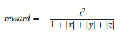
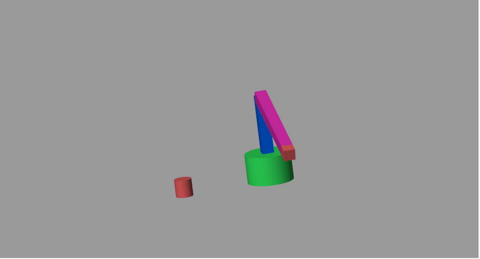
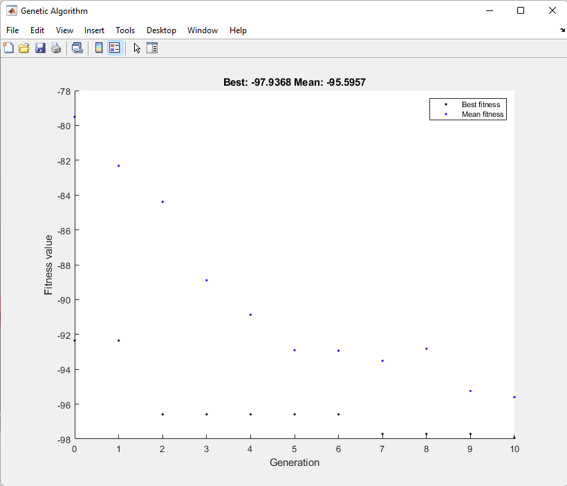
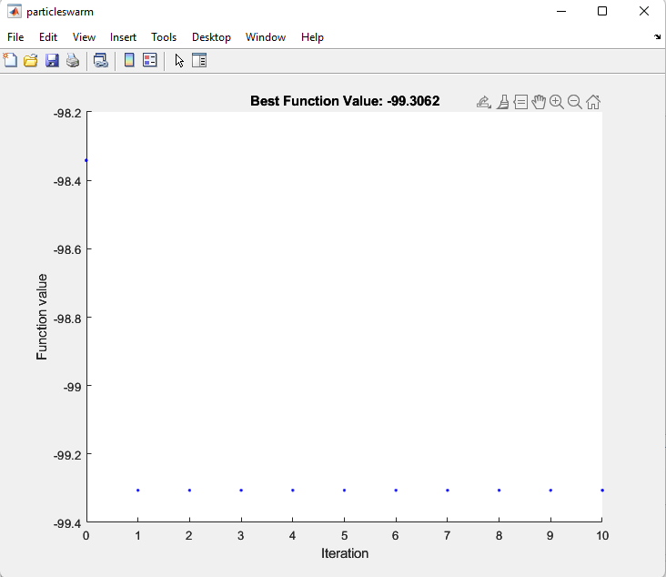

# OptimizationInMatlab
# Учебный проект по курсу "Разработка и оптимизация робототехнических систем"
Робот-манипулятор двухзвенный 
Выполнил: студент группы R4136c, Ларченков Артем
## Цель работы: Оптимизация траектории робота с помощью генетического алгоритма и с помощью метода роя.

Модель робота-манипулятора:

Результаты обучения с помощью генетического алгоритма:

Результаты обучения с помощью метода роя:

